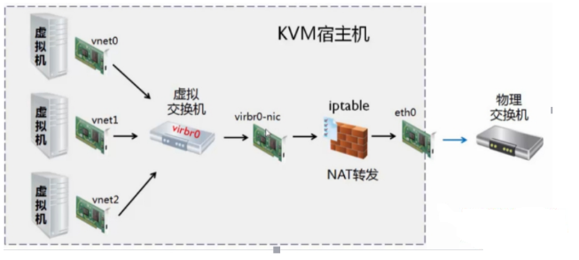
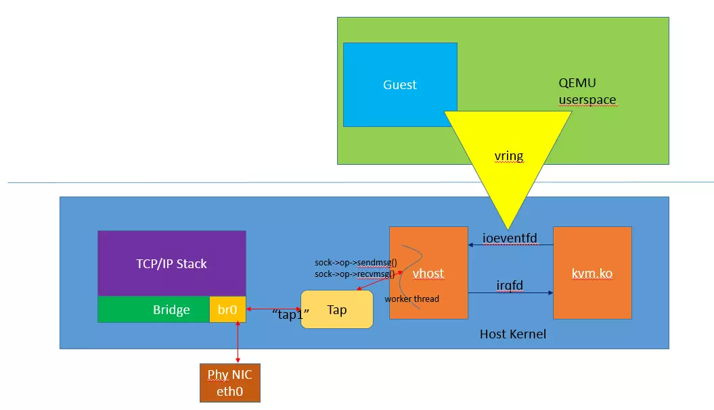
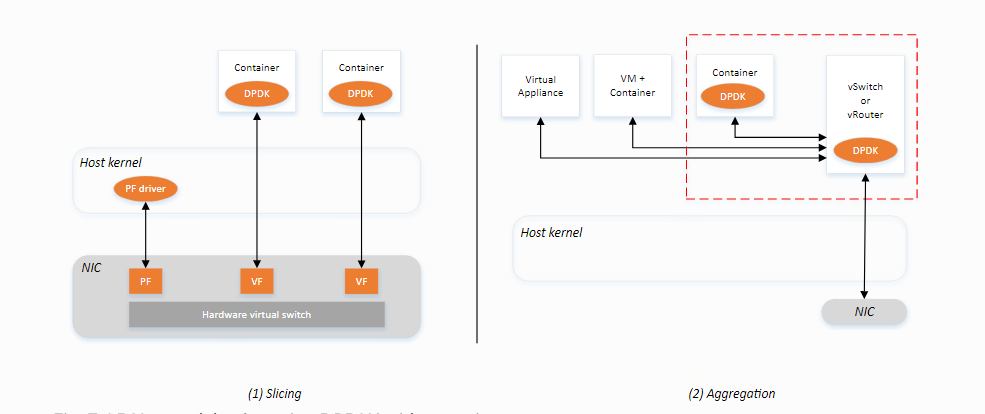
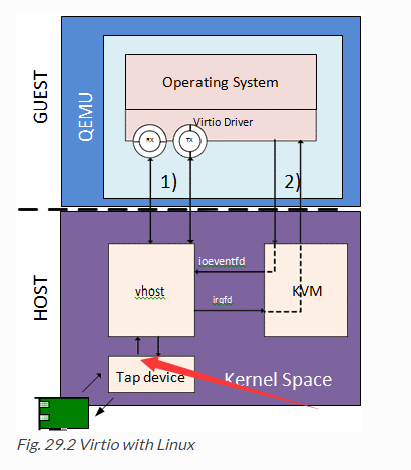

# 拓扑结构(NAT)

原理图：

# **制作镜像(NAT)**

## 准备基础ISO镜像

-   官方[CentOS-7-x86_64-Minimal-1511.iso](https://buildlogs.centos.org/rolling/7/isos/x86_64/CentOS-7-x86_64-Minimal-1511.iso)
    (centos7.2)

| mkdir -p /export/servers && cd /export/servers   git lfs clone --depth=1 <https://git.jd.com/dns-anti/dns-vm.git>   git lfs pull   mkdir -p /export/images/   cp /export/servers/dns-vm/adns/images/CentOS-7-x86_64-Minimal-1511.iso /export/images/ <br\> |
|--------------------------------------------------------------------------------------------------------------------------------------------------------------------------------------------------------------------------------------------------------------------------------------|

## 先决条件

-   cpu支持：egrep -q "vmx\|svm" /proc/cpuinfo && echo "yes"

-   内存支持：free -h (大于64g)

-   内核支持：lsmod \|grep kvm

-   Selinux支持：setenforce 0 && sestatus

-   大页内存支持：cat /proc/cpuinfo \| grep pdpe1gb

-   支持转发：sysctl -w net.ipv4.ip_forward=1

-   物理机有外网访问权限

## 准备大页内存

| sh /export/servers/dns-vm/adns/tools/install_hugepages.sh //配置大页内存    reboot //重启服务器    cat /proc/meminfo\|grep Huge //检查大页内存是否生效 |
|--------------------------------------------------------------------------------------------------------------------------------------------------|

## 安装依赖

-   安装

| yum -y install qemu-kvm virt-install libvirt bridge-utils systemctl enable libvirtd && systemctl start libvirtd |
|-----------------------------------------------------------------------------------------------------------------|

-   检查

| 1./usr/sbin/libvirtd --version   /usr/sbin/libvirtd (libvirt) 4.5.0   2./usr/libexec/qemu-kvm --version   QEMU emulator version 1.5.3 (qemu-kvm-1.5.3-167.el7_7.4), Copyright (c) 2003-2008 Fabrice Bellard   注意： 报错：version libssl.so.10 not defined in file libssl.so.10   修复：yum -y install openssl && yum -y update openssl   3.uname -r(大于等于2.6.20，自动包含kvm内核模块) 3.10.0-327.28.3.el7.x86_64   4.virsh list --all |
|------------------------------------------------------------------------------------------------------------------------------------------------------------------------------------------------------------------------------------------------------------------------------------------------------------------------------------------------------------------------------------------------------------------------------|

## 制作镜像

### 安装系统

>   virt-install \\

\--name adns-vm \\(虚拟机名称)

\--vcpus=8 \\(虚拟机cpu个数)

\--memory 32768 \\(虚拟机内存大小，单位MB，32G)

\--disk /export/images/adns-vm.qcow2,size=100,format=qcow2
\\(存储磁盘格式及大小，单位GB, 100G)

\--network default \\(虚拟机网卡：默认为nat模式，网桥模式：--network bridge:br0)

\--os-type=linux \\(虚拟机操作系统类型)

\--os-variant=rhel7.2 \\(虚拟机操作系统具体版本)

\--location /export/images/CentOS-7-x86_64-Minimal-1511.iso \\(安装源地址)

\--extra-args "console=ttyS0" \\(虚拟机登录字符终端)

\--graphics none \\(虚拟机不开启图形登录界面)

\--force(防止交互式提示)

| cd /export/images/ virt-install \    --name adns-vm \    --vcpus=8 \    --memory 32768 \    --disk /export/images/adns-vm.qcow2,size=100,format=qcow2 \    --network default \    --os-type=linux \    --os-variant=rhel7.2 \    --location /export/images/CentOS-7-x86_64-Minimal-1511.iso \    --extra-args "console=ttyS0" \    --graphics none \    --force |
|-------------------------------------------------------------------------------------------------------------------------------------------------------------------------------------------------------------------------------------------------------------------------------------------------------------------------------------------|

### 配置系统

上面创建虚拟机命令最终需要你配置系统基础设置，带 [!]
基本都是要配置的，按照顺序往下配置，按对用的数字以此进行设置。

| Installation     1) [x] Language settings 2) [!] Timezone settings     (English (United States)) (Timezone is not set.)(Shanghai)     3) [!] Installation source 4) [!] Software selection     (Processing...)(local) (Processing...)(minimal)     5) [!] Installation Destination 6) [x] Kdump     (No disks selected)(all) (Kdump is enabled)     7) [ ] Network configuration 8) [!] Root password     (Not connected) (Password is not set.)     9) [!] User creation  (No user will be created)     Please make your choice from above ['q' to quit | 'b' to begin installation |  'r' to refresh]:    设置2(asia-shanghai),4(默认),5(全部默认),8(adns), b(开始安装) |
|--------------------------------------------------------------------------------------------------------------------------------------------------------------------------------------------------------------------------------------------------------------------------------------------------------------------------------------------------------------------------------------------------------------------------------------------------------------------------------------------------------------------------------------------------------------------------------------------------------------------------------------------|

## 编辑镜像

### 设置网络

>   ipv4地址配置：

| 虚拟机：    virsh console adns-vm //登录虚拟机    vi /etc/sysconfig/network-scripts/ifcfg-eth0 //网卡改为自启动    TYPE=Ethernet BOOTPROTO=dhcp    …    NAME=eth0    UUID=c4437b5b-cdda-4a6e-a9ed-61241ad38fdc    DEVICE=eth0    ONBOOT=yes |
|---------------------------------------------------------------------------------------------------------------------------------------------------------------------------------------------------------------------|

Ctrl+] //退出虚拟机

>   ipv6地址配置：

| 物理机：    virsh shutdown adns-vm    virsh net-destroy default    virsh net-edit default    \<network\>     \<name\>default\</name\>     \<uuid\>869052a8-a707-43a5-b16a-bca137e1432f\</uuid\>     \<forward mode='nat'/\>     \<bridge name='virbr0' stp='off' delay='0'/\>     \<mac address='52:54:00:f9:c1:76'/\>     \<ip address='192.168.122.1' netmask='255.255.255.0'\>     \<dhcp\>     \<range start='192.168.122.2' end='192.168.122.254'/\>     \</dhcp\>     \</ip\>     \<ip family='ipv6' address='2001:db8:dead:beef:fe::2' prefix='96'/\>    \</network\> |
|------------------------------------------------------------------------------------------------------------------------------------------------------------------------------------------------------------------------------------------------------------------------------------------------------------------------------------------------------------------------------------------------------------------------------------------------------------------------------------------------------------------------------|

virsh net-start default

virsh start adns-vm

虚拟机：

virsh console adns-vm

vi /etc/sysconfig/network-scripts/ifcfg-eth0

| TYPE=Ethernet    BOOTPROTO=dhcp    DEFROUTE=yes    PEERDNS=yes    PEERROUTES=yes    IPV4_FAILURE_FATAL=no    IPV6INIT=yes    IPV6_AUTOCONF=no    IPV6ADDR=2001:db8:dead:beef:fe::8001/96    IPV6DEFAULTGW=fe80::5054:ff:fef9:c176/64    NAME=eth0    UUID=c4437b5b-cdda-4a6e-a9ed-61241ad38fdc    DEVICE=eth0    ONBOOT=yes |
|--------------------------------------------------------------------------------------------------------------------------------------------------------------------------------------------------------------------------------------------------------------------------------------|

systemctl restart network

ping6 2001:db8:dead:beef:fe::2

Ctrl+] //退出虚拟机

### 设置cpu/内存/网卡

虚拟机：

| virsh edit adns-vm //编辑虚拟机配置文件    //使用物理机配置的大页内存，开启网卡多队列    \<domain type='kvm' id='3'\>     \<name\>adns-vm\</name\>     \<uuid\>ff91ffdf-3820-40d0-badd-b66773173b5e\</uuid\>     \<memory unit='G'\>64\</memory\>    \<currentMemory unit='G'\>64\</currentMemory\>    \<memoryBacking\>    \<hugepages\>    \<page size='1' unit='G' /\>    \</hugepages\>     \</memoryBacking\>     \<vcpu placement='static'\>8\</vcpu\>     \<cputune\>    \<vcpupin vcpu='0' cpuset='0' /\>    \<vcpupin vcpu='1' cpuset='2' /\>    \<vcpupin vcpu='2' cpuset='4' /\>    \<vcpupin vcpu='3' cpuset='6' /\>    \<vcpupin vcpu='4' cpuset='8' /\>    \<vcpupin vcpu='5' cpuset='10' /\>    \<vcpupin vcpu='6' cpuset='12' /\>    \<vcpupin vcpu='7' cpuset='14' /\>     \</cputune\>     …     \<cpu mode='custom' match='exact' check='full'\>    \<model fallback='forbid'\>Haswell\</model\>    \<feature policy='force' name='pdpe1gb'/\>     \<feature policy='disable' name='hle'/\>     \<feature policy='disable' name='rtm'/\>     \<feature policy='require' name='hypervisor'/\>     \<feature policy='require' name='xsaveopt'/\>     \</cpu\>     …    \<interface type='network'\>    \<source network='default'/\>    \<model type='virtio'/\>    \<driver name='vhost' queues='8'/\>    \<address type='pci' domain='0x0000' bus='0x00' slot='0x03' function='0x0'/\>    \</interface\>    …    \</domain\> |
|-------------------------------------------------------------------------------------------------------------------------------------------------------------------------------------------------------------------------------------------------------------------------------------------------------------------------------------------------------------------------------------------------------------------------------------------------------------------------------------------------------------------------------------------------------------------------------------------------------------------------------------------------------------------------------------------------------------------------------------------------------------------------------------------------------------------------------------------------------------------------------------------------------------------------------------------------------------------------------------------------------------------------------------------------------------------------------------------------------------------------------------------------------------------------------------------------------------------------------------------------------------------------------------------------------------------------|

virsh start adns-vm//开启虚拟机

virsh console adns-vm//登录虚拟机

| sed -i '/GRUB_CMDLINE_LINUX/ s/"\$/ default_hugepagesz=1G hugepagesz=1G hugepages=32"/' /etc/default/grub //修改虚拟机grub    grub2-mkconfig -o /boot/grub2/grub.cfg //重新生成grub    sed -i 's/=enforcing/=disabled/' /etc/selinux/config \#关闭selinux,重启生效    systemctl disable NetworkManager    reboot |
|------------------------------------------------------------------------------------------------------------------------------------------------------------------------------------------------------------------------------------------------------------------------------------------------------|

cat /proc/meminfo \|grep Huge //验证

## 安装adns

| ssh root\@vm-ip mkdir -p /export/servers/    安装基础环境    yum -y install git yum -y group install "Development Tools"    安装go编译环境(用于dns-agent编译)    rpm --import https://mirror.go-repo.io/centos/RPM-GPG-KEY-GO-REPO    curl -s https://mirror.go-repo.io/centos/go-repo.repo \| tee /etc/yum.repos.d/go-repo.repo    yum -y install golang    安装adns依赖(git/redis/keepalived)    cd /export/servers/    git clone --depth=1 <https://git.jd.com/dns-anti/adns-docker.git>    cd /export/servers/adns-docker/git-upgrade && sh ./run.sh upgrade //升级git版本    cd /export/servers/adns-docker/    如果已执行可跳过：sh install_hugepages_1g.sh 或者 sh install_hugepages_2m.sh //设置大页内存    python docker/dependent-lib/dpdk/dpdk-stable-16.11.2/tools/dpdk-devbind.py --status //获取网卡的编号    sh install.sh [设备的pci地址] //安装依赖(pci地址可通过install.sh不加参数获取)    安装adns    cd /export/servers/    git clone --depth=1 <http://git.jd.com/dns-anti/TPDNS.git> adns    cd /export/servers/adns    sh build.sh     安装dns-agent(可选，用于流量统计)    cd /export/servers/    git clone --depth=1 https://git.jd.com/dns-anti/dns-agent.git     cd /export/servers/dns-agent    sh build.sh     修改网卡启动模式 //网卡改为非自启动，因为dpdk不能操作已经启动的网卡    vi /etc/sysconfig/network-scripts/ifcfg-eth0     TYPE=Ethernet    BOOTPROTO=dhcp    …    NAME=eth0    UUID=c4437b5b-cdda-4a6e-a9ed-61241ad38fdc    DEVICE=eth0    ONBOOT=no |
|---------------------------------------------------------------------------------------------------------------------------------------------------------------------------------------------------------------------------------------------------------------------------------------------------------------------------------------------------------------------------------------------------------------------------------------------------------------------------------------------------------------------------------------------------------------------------------------------------------------------------------------------------------------------------------------------------------------------------------------------------------------------------------------------------------------------------------------------------------------------------------------------------------------------------------------------------------------------------------------------------------------------------------------------------------------------------------------------------------------------------------------------------------------------------------------------------------------------------------------------------------------------------------------------------------------------------------------------------------------------------------------------|

## 配置adns

### adns

| vi /export/servers/adns/output/etc/adns.conf(红色部分按需修改)                                                                                                                                                                                                                                                                                                                                                                                                                                                                                                                                                                                                                                                                                                                                                                                                                                                                                                                                                                                                                                                                                                                                                                                                                                                                                                                                                                                                                                                                                                                                                                                                                                                                                                                                                                                                                                                                                                                                                                                                                                                                                                                                                                                                                                                                                                                                                                                                                                                                                                                                                                                                                                                                                                                                                                                                                                                                                                                                                                                                                                                                                                                                                                                                                                                                                                                                                                                                                                          |
|---------------------------------------------------------------------------------------------------------------------------------------------------------------------------------------------------------------------------------------------------------------------------------------------------------------------------------------------------------------------------------------------------------------------------------------------------------------------------------------------------------------------------------------------------------------------------------------------------------------------------------------------------------------------------------------------------------------------------------------------------------------------------------------------------------------------------------------------------------------------------------------------------------------------------------------------------------------------------------------------------------------------------------------------------------------------------------------------------------------------------------------------------------------------------------------------------------------------------------------------------------------------------------------------------------------------------------------------------------------------------------------------------------------------------------------------------------------------------------------------------------------------------------------------------------------------------------------------------------------------------------------------------------------------------------------------------------------------------------------------------------------------------------------------------------------------------------------------------------------------------------------------------------------------------------------------------------------------------------------------------------------------------------------------------------------------------------------------------------------------------------------------------------------------------------------------------------------------------------------------------------------------------------------------------------------------------------------------------------------------------------------------------------------------------------------------------------------------------------------------------------------------------------------------------------------------------------------------------------------------------------------------------------------------------------------------------------------------------------------------------------------------------------------------------------------------------------------------------------------------------------------------------------------------------------------------------------------------------------------------------------------------------------------------------------------------------------------------------------------------------------------------------------------------------------------------------------------------------------------------------------------------------------------------------------------------------------------------------------------------------------------------------------------------------------------------------------------------------------------------------------|
| 配置太长 --- 参见docx文档 |

### conf-pull

| vi /export/servers/adns/output/etc/conf-pull.conf(红色部分按需修改)                                                                                                                                                                                                                                                                                                                                                                                                                                                                      |
|------------------------------------------------------------------------------------------------------------------------------------------------------------------------------------------------------------------------------------------------------------------------------------------------------------------------------------------------------------------------------------------------------------------------------------------------------------------------------------------------------------------------------------------|
| 配置太长 --- 参见docx文档 |
| 设置conf-pull.py免密登录git服务器：    ssh-keygen -t rsa (连续三次回车,即在本地生成了公钥和私钥,不设置密码)    ssh-copy-id -i \~/.ssh/id_rsa.pub 用户名\@git-ip                                                                                                                                                                                                                                                                                                                                                                                |

### dns-agent

| vi /export/servers/dns-agent/output/conf/config.json(红色部分按需修改)                                                                                                                                                                                                                                                                                                                                                                                                                                                                                                                                                                                                                                                                                                                                                                                                                                                                                                                                                                                                                                                                                                                                                                                                                                                                                                                                                                                                                                                                                                                                                                                                   |
|--------------------------------------------------------------------------------------------------------------------------------------------------------------------------------------------------------------------------------------------------------------------------------------------------------------------------------------------------------------------------------------------------------------------------------------------------------------------------------------------------------------------------------------------------------------------------------------------------------------------------------------------------------------------------------------------------------------------------------------------------------------------------------------------------------------------------------------------------------------------------------------------------------------------------------------------------------------------------------------------------------------------------------------------------------------------------------------------------------------------------------------------------------------------------------------------------------------------------------------------------------------------------------------------------------------------------------------------------------------------------------------------------------------------------------------------------------------------------------------------------------------------------------------------------------------------------------------------------------------------------------------------------------------------------|
| 配置太长 --- 参见docx文档 |

### keepalived

>   虚拟机：

| vi /export/servers/keepalived-1.3.5/etc/keepalived.conf(红色部分按需修改)                                                                                                                                                                                                                                                                                                                                                                                                                                                                                                                                                                                                                                                                                                                                                                                                                                                                                                                                                                                                                                                                                                                                                                                                                            |
|------------------------------------------------------------------------------------------------------------------------------------------------------------------------------------------------------------------------------------------------------------------------------------------------------------------------------------------------------------------------------------------------------------------------------------------------------------------------------------------------------------------------------------------------------------------------------------------------------------------------------------------------------------------------------------------------------------------------------------------------------------------------------------------------------------------------------------------------------------------------------------------------------------------------------------------------------------------------------------------------------------------------------------------------------------------------------------------------------------------------------------------------------------------------------------------------------------------------------------------------------------------------------------------------------|
| 配置太长 --- 参见docx文档 |

## 启动adns

| vi /etc/rc.local //设置服务随系统自启动(keepalived除外)    \#!/bin/bash    \# THIS FILE IS ADDED FOR COMPATIBILITY PURPOSES    \# \# It is highly advisable to create own systemd services or udev rules    \# to run scripts during boot instead of using this file.    \# \# In contrast to previous versions due to parallel execution during boot    \# this script will NOT be run after all other services.    \# \# Please note that you must run 'chmod +x /etc/rc.d/rc.local' to ensure    \# that this script will be executed during boot.    touch /var/lock/subsys/local    sh /export/servers/dns-agent/output/bin/control start    sh /export/servers/adns-docker/install.sh 0000:00:03.0 |
|-------------------------------------------------------------------------------------------------------------------------------------------------------------------------------------------------------------------------------------------------------------------------------------------------------------------------------------------------------------------------------------------------------------------------------------------------------------------------------------------------------------------------------------------------------------------------------------------------------------------------------------------------------------------------|

python /export/servers/adns/output/bin/conf-pull.py //第一次启动前需要有配置存在

ip link set eth0 down //停止网卡用于绑定

sh /export/servers/adns-docker/install.sh [设备的pci地址] //绑定网卡

sh /export/servers/dns-agent/output/bin/control restart //重启dns-agent

systemctl restart redis //重启redis

sh /export/servers/adns/output/bin/control restart //重启adns

systemctl restart keepalived //重启keepalived

ip route add default via 192.168.122.1 dev vEth0 //增加默认路由

ip -6 route add default via 2001:db8:dead:beef:fe::2 dev vEth0 //增加默认路由

## 测试adns

>   物理机：

| dig \@vm-ipv4    dig \@vm-ipv6    dig \@keepalived-vip    ping vm-ipv4    ping vm-ipv6    ping keepalived-vip |
|------------------------------------------------------------------------------------------------|

## 清理虚拟机

>   虚拟机：

| virsh console adns-vm    sh /export/servers/adns/output/bin/control stop //停止adns    软件清理：    mv /export/servers/adns-docker /export/servers/adns-docker.bak    mkdir -p /export/servers/adns-docker && cp /export/servers/adns-docker.bak/install.sh /export/servers/adns-docker    \\rm -rf /export/servers/adns-docker.bak    mv /export/servers/adns /export/servers/adns.bak    mkdir -p /export/servers/adns && cp -r /export/servers/adns.bak/output /export/servers/adns/    \\rm -rf /export/servers/adns.bak     \\rm -rf /export/servers/adns/output/etc/\*.map    \\rm -rf /export/tp-dns/log    \\rm -rf /export/tp-dns/git-merge    \\rm -rf /export/tp-dns/git-local    \\rm -rf /export/tp-dns/etc    \\rm -rf /export/tp-dns/dump    \\rm -rf /export/tp-dns/adns-conf/views/\*    \\rm -rf /export/tp-dns/adns-conf/zones/\*    \\rm -rf /export/servers/adns/log    yum清理：    yum clean all    历史记录清理：    echo "" \> \~/.bash_history && history -c    清理已删除空间：    dd if=/dev/zero of=/zero.dat //虚拟机系统对剩余空间写零操作    \\rm -rf /zero.dat //删除零文件 |
|---------------------------------------------------------------------------------------------------------------------------------------------------------------------------------------------------------------------------------------------------------------------------------------------------------------------------------------------------------------------------------------------------------------------------------------------------------------------------------------------------------------------------------------------------------------------------------------------------------------------------------------------------------------------------------------------------------------------------------------------------------------------------------------------------------------------------------------------------------------------------------------------------------------------------------------------------------------------------------------------------------------------------------------|

## 压缩备份镜像

>   物理机：

| virsh attach-disk --type cdrom --mode readonly adns-vm "" hda //卸载ISO    virsh shutdown adns-vm //关闭虚拟机    virsh dumpxml adns-vm \> /export/images/adns-vm-release-20200723.xml //导出虚拟机配置    //压缩虚拟机镜像 qemu-img convert -c -O qcow2 /export/images/adns-vm.qcow2 /export/images/adns-vm-release-20200723.qcow2    //修改新虚拟机配置中镜像路径    vi /export/images/adns-vm-release-20200723.xml    \<domain type='kvm'\>     \<name\>adns-vm\</name\>     \<uuid\>51b1f6d9-8f90-4c40-bbc8-38146e81a7c3\</uuid\>     …     \<devices\>     \<emulator\>/usr/libexec/qemu-kvm\</emulator\>     \<disk type='file' device='disk'\>     \<driver name='qemu' type='qcow2'/\>     \<source file='/export/images/adns-vm-release-20200723.qcow2'/\>     \<target dev='vda' bus='virtio'/\>     \<address type='pci' domain='0x0000' bus='0x00' slot='0x06' function='0x0'/\>    \</disk\>    \</devices\>    \</domain\> |
|---------------------------------------------------------------------------------------------------------------------------------------------------------------------------------------------------------------------------------------------------------------------------------------------------------------------------------------------------------------------------------------------------------------------------------------------------------------------------------------------------------------------------------------------------------------------------------------------------------------------------------------------------------------------------------------------------------------------------------------------------------------------------------------------------------------------------------------------------------------------------------|

## 虚拟机相关命令

>   物理机：

| 列出虚拟机：virsh list    强制停止虚拟机：virsh destroy adns-vm (相当于物理机的直接关闭电源)    正常停止虚拟机：virsh shutdown adns-vm    删除虚拟机：virsh undefine adns-vm    查找并删除虚拟机相关文件：updatedb && locate adns-vm && rm –rf 找到的文件    重启虚拟机：virsh reboot adns-vm    查看虚拟机配置：virsh dumpxml adns-vm    编辑虚拟机配置：virsh destroy adns-vm && virsh edit adns-vm    登录虚拟机：ssh root\@ip    登录虚拟机：virsh console adns-vm    退出虚拟机：Ctrl + ]    添加网卡： virsh attach-interface    \\ --domain adns-vm    \\ --type network    \\ --source default    \\ --model virtio    \\ --config    \\ --live    删除网卡： virsh detach-interface    \\ --domain adns-vm    \\ --type network    \\ --mac 52:54:00:1a:3e:91    \\ --config |
|---------------------------------------------------------------------------------------------------------------------------------------------------------------------------------------------------------------------------------------------------------------------------------------------------------------------------------------------------------------------------------------------------------------------------------------------------------------------------------------------------------------------------------------------------------------------------------------------------------------------------------------------------------------------------------------------------------------------|

# 拓扑结构(网桥)

原理图：

# **部署镜像(网桥)**

## 先决条件

-   cpu支持：egrep -q "vmx\|svm" /proc/cpuinfo && echo "yes"

-   内存支持：free -h (大于64g)

-   内核支持：lsmod \|grep kvm

-   Selinux支持：setenforce 0 && sestatus

-   大页内存支持：cat /proc/cpuinfo \| grep pdpe1gb

-   支持转发：sysctl -w net.ipv4.ip_forward=1

## 安装依赖

-   安装

| yum -y install qemu-kvm virt-install libvirt bridge-utils    systemctl enable libvirtd && systemctl start libvirtd |
|-----------------------------------------------------------------------------------------------------------------|

-   检查

| 1./usr/sbin/libvirtd --version    /usr/sbin/libvirtd (libvirt) 4.5.0    2./usr/libexec/qemu-kvm --version    QEMU emulator version 1.5.3 (qemu-kvm-1.5.3-167.el7_7.4), Copyright (c) 2003-2008 Fabrice Bellard    注意：    报错：version libssl.so.10 not defined in file libssl.so.10    修复：yum -y install openssl && yum -y update openssl    3.uname -r(大于等于2.6.20，自动包含kvm内核模块) 3.10.0-327.28.3.el7.x86_64    4.virsh list --all |
|------------------------------------------------------------------------------------------------------------------------------------------------------------------------------------------------------------------------------------------------------------------------------------------------------------------------------------------------------------------------------------------------------------------------------|

## 设置网桥

### 管理口网桥

| 增加网桥：    vi /etc/sysconfig/network-scripts/ifcfg-br-manager //创建网桥(ip及路由来自eth0)    DEVICE=br-manager    TYPE=Bridge    BOOTPROTO=static    IPADDR=10.226.133.67    NETMASK=255.255.255.224    GATEWAY=10.226.133.97    ONBOOT=yes |
|-------------------------------------------------------------------------------------------------------------------------------------------------------------------------------------------------------------------------|

vi /etc/sysconfig/network-scripts/ifcfg-eth0 //添加设备到网桥

| DEVICE=eth0    TYPE=Ethernet    BOOTPROTO=static    IPADDR=0.0.0.0    ONBOOT=yes    BRIDGE=br-manager |
|----------------------------------------------------------------------------------------|

重启网卡：

| systemctl restart network |
|---------------------------|

### 业务口网桥

| 增加网桥：    vi /etc/sysconfig/network-scripts/ifcfg-br-dpdk //创建网桥    DEVICE=br-dpdk    TYPE=Bridge    BOOTPROTO=static    IPADDR=2.2.3.6    NETMASK=255.255.255.0    ONBOOT=yes |
|-------------------------------------------------------------------------------------------------------------------------------------------------------------------|

vi /etc/sysconfig/network-scripts/ifcfg-eth1 //添加设备到网桥

| DEVICE=eth1    TYPE=Ethernet    BOOTPROTO=static    IPADDR=0.0.0.0    ONBOOT=yes    BRIDGE=br-dpdk |
|-------------------------------------------------------------------------------------|

重启网卡：

| /etc/sysconfig/network-scripts/ifdown eth1 //停止网卡    /etc/sysconfig/network-scripts/ifup eth1 //启动网卡    /etc/sysconfig/network-scripts/ifup br-dpdk //启动网桥    ip route add 2.2.1.0/24 via 2.2.3.1 dev br-dpdk //配置网桥路由 |
|---------------------------------------------------------------------------------------------------------------------------------------------------------------------------------------------------------------------------------|

## 获取镜像

| yum install -y git git-lfs    git lfs install    mkdir -p /export/servers && cd /export/servers    git lfs clone --depth=1 -b test <https://git.jd.com/dns-anti/dns-vm.git>    cd dns-vm && git lfs pull    mkdir -p /export/images/    cp /export/servers/dns-vm/adns/images/adns-vm-release-20200723\* /export/images/ |
|--------------------------------------------------------------------------------------------------------------------------------------------------------------------------------------------------------------------------------------------------------------------------------------------------------|

## 准备大页内存

| sh /export/servers/dns-vm/adns/tools/install_hugepages.sh //配置大页内存    reboot //重启服务器    cat /proc/meminfo\|grep Huge //检查大页内存是否生效 |
|--------------------------------------------------------------------------------------------------------------------------------------------------|

## 优化tap队列

| //将tap网卡默认的txqueue长度由500改为10000,防止丢包    cat \<\<'EOF'\>/etc/udev/rules.d/71-net-txqueuelen.rules SUBSYSTEM=="net",ACTION=="add",KERNEL=="tap\*",ATTR{tx_queue_len}="10000" EOF |
|--------------------------------------------------------------------------------------------------------------------------------------------------------------------------------------------|

## 启动镜像

| virsh define /export/images/adns-vm-release-20200723.xml //创建虚拟机    virsh list --all //查看虚拟机     virsh edit adns-vm //编辑网卡    \<interface type='bridge'\>    \<mac address='52:54:00:b9:05:4f'/\>    \<source bridge='br-dpdk'/\>    \<target dev='tap-dpdk'/\>    \<model type='virtio'/\>    \<driver name='vhost' queues='8'/\>    \<address type='pci' domain='0x0000' bus='0x00' slot='0x03' function='0x0'/\>    \</interface\>    \<interface type='bridge'\>    \<mac address='52:54:00:e6:bc:3c'/\>    \<source bridge='br-manager'/\>    \<target dev='tap-manager'/\>    \<model type='virtio'/\>    \<address type='pci' domain='0x0000' bus='0x00' slot='0x09' function='0x0'/\>    \</interface\> |
|----------------------------------------------------------------------------------------------------------------------------------------------------------------------------------------------------------------------------------------------------------------------------------------------------------------------------------------------------------------------------------------------------------------------------------------------------------------------------------------------------------------------------------------------------------------------------------------------------------------------------------------------------------------------------|

virsh start adns-vm //启动虚拟机

virsh console adns-vm //登录虚拟机

修改网卡配置：

| vi /etc/sysconfig/network-scripts/ifcfg-eth0(业务口：改为不自启动)    TYPE=Ethernet    BOOTPROTO=dhcp    DEFROUTE=yes    PEERDNS=yes    PEERROUTES=yes    IPV4_FAILURE_FATAL=no    IPV6INIT=yes    IPV6_AUTOCONF=yes    IPV6_DEFROUTE=yes    IPV6_PEERDNS=yes    IPV6_PEERROUTES=yes    IPV6_FAILURE_FATAL=no    NAME=eth0    UUID=da4f1eab-5423-49a3-b4a5-47f69a6f7b27    DEVICE=eth0    ONBOOT=no |
|-----------------------------------------------------------------------------------------------------------------------------------------------------------------------------------------------------------------------------------------------------------------------------------------------------------------------------------------------------|

vi /etc/sysconfig/network-scripts/ifcfg-eth1(管理口：红色部分按需修改)

| TYPE=Ethernet    BOOTPROTO=static    IPADDR=10.226.133.77    NETMASK=255.255.255.224    GATEWAY=10.226.133.97    DEFROUTE=yes    PEERDNS=yes    PEERROUTES=yes    IPV4_FAILURE_FATAL=no    IPV6INIT=yes    IPV6_AUTOCONF=no    IPV6ADDR=2001::77/96    IPV6DEFAULTGW=2001::1/64    NAME=eth1    UUID=9aa218da-7502-4820-b2e4-635d45393622    DEVICE=eth1    ONBOOT=yes |
|------------------------------------------------------------------------------------------------------------------------------------------------------------------------------------------------------------------------------------------------------------------------------------------------------------------------|

systemctl restart network //重启网卡

修改adns配置：

| vi /export/servers/adns/output/etc/adns.conf //修改adns配置(参考2.8.1节)    vi /export/servers/adns/output/etc/conf-pull.conf //修改conf-pull配置(参考2.8.2节)    vi /export/servers/dns-agent/output/conf/config.json //修改dns-agent配置(参考2.8.3节)    vi /export/servers/keepalived-1.3.5/etc/keepalived.conf //修改keepalived配置(参考2.8.4节)    设置conf-pull.py免密登录git服务器：    ssh-keygen -t rsa (连续三次回车,即在本地生成了公钥和私钥,不设置密码)    ssh-copy-id -i \~/.ssh/id_rsa.pub 用户名\@git-ip |
|-------------------------------------------------------------------------------------------------------------------------------------------------------------------------------------------------------------------------------------------------------------------------------------------------------------------------------------------------------------------------------------------------------------------------------------------------------------------------------------------------------|

sh /export/servers/dns-agent/output/bin/control restart //重启dns-agent

sh /export/servers/adns/output/bin/control restart //重启adns

systemctl restart keepalived //重启keepalived

ip route add 2.2.1.0/24 via 2.2.3.1 dev vEth0 //配置业务口路由

# **Q&A**

## Q: pdump收不到包

>   A:
>   dpdk收发包队列个数在虚拟机环境必须一致，否则会出现大量丢包，物理机没有限制；

## Q: 双网卡绑定

>   A: 增加物理机bond配置，其他参考4.4.1

| vim /etc/sysconfig/network-scripts/ifcfg-bond0 //添加bond0到网桥(红色部分按需修改)                                                                                                   |
|--------------------------------------------------------------------------------------------------------------------------------------------------------------------------------------|
| DEVICE=bond0    NAME=bond0    TYPE=Bond    USERCTL=no    BOOTPROTO=none    ONBOOT=yes    BONDING_MASTER=yes    BONDING_OPTS="mode=1 miimon=100" \# 这里bonding模式是1，根据你的选择而配置    BRIDGE=adns-br0 |
| vim /etc/sysconfig/network-scripts/ifcfg-em1 //添加em1到bond0(红色部分按需修改)                                                                                                      |
| DEVICE=em1    USERCTL=no    ONBOOT=yes    MASTER=bond0    SLAVE=yes    BOOTPROTO=none                                                                                                               |
| vim /etc/sysconfig/network-scripts/ifcfg-em2 //添加em2到bond0(红色部分按需修改)                                                                                                      |
| DEVICE=em2    USERCTL=no    ONBOOT=yes    MASTER=bond0    TYPE=Ethernet    SLAVE=yes    BOOTPROTO=none                                                                                                 |

## Q: 为什么不用docker

>   A: dpdk支持docker有两种方式，如下图：

>   Slicing: 需要物理网卡支持SR-IOV，对硬件依然有依赖；

>   Aggregation: 需要在物理机安装支持dpdk的虚拟机交换机，部署复杂；

## Q: tap网卡txdrop

A:
具体原因为虚拟机的cpu被用于处理其他问题，导致没有及时的响应io中断，导致tap网卡的txqueue满，从而丢包；两个方面解决：1.cpu绑定；2.txqueue增大；

# **参考文档**

-   [KVM/QEMU/qemu-kvm/libvirt
    概念全解](https://blog.csdn.net/Jmilk/article/details/68947277)

-   [KVM虚拟机网络闪断分析](https://www.cnblogs.com/Bozh/p/5484838.html)
